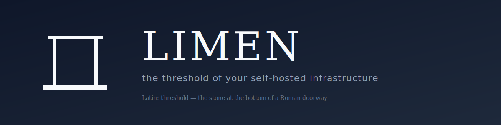

  

<h1 align="center">Limen</h1>

  <em>Latin: "threshold"</em> — the stone at the bottom of a Roman doorway, marking the line between inside and outside.

---

**Limen** is a self-hosted infrastructure platform. One tool does what normally takes three:

- 🚢 **Docker deploy management** — auto-deploy services when their container image is updated in a registry
- 🔐 **Reverse proxy with automatic TLS** — public ingress, hostname routing, Let's Encrypt certificates
- 🕸️ **WireGuard hub-and-spoke VPN** — connect remote sites without opening inbound ports on them

One admin. One Angular UI. PostgreSQL-only datastore. `docker compose up` to install.

> **Status:** in active development. See [`limen/docs/HANDOFF.md`](https://github.com/getlimen/limen/blob/main/docs/HANDOFF.md).

---

## Four components

Named after Roman doorway deities — the Romans had a specific deity for each part of a door.

<table>
  <tr>
    <td align="center" width="25%"> <b>limen</b> <em>threshold</em> central manager</td>
    <td align="center" width="25%"> <b>ostiarius</b> <em>doorkeeper</em> reverse proxy + TLS</td>
    <td align="center" width="25%"> <b>forculus</b> <em>door panel</em> WireGuard hub</td>
    <td align="center" width="25%"> <b>limentinus</b> <em>threshold guardian</em> node agent</td>
  </tr>
</table>

## Repositories

| Repo | Role |
|------|------|
| [**limen**](https://github.com/getlimen/limen) | Central manager — C# + Angular + Postgres. Hosts design spec, plans, all shared docs. |
| [**ostiarius**](https://github.com/getlimen/ostiarius) | Custom reverse proxy — C# NativeAOT, YARP, LettuceEncrypt-Archon |
| [**forculus**](https://github.com/getlimen/forculus) | WireGuard hub — C# NativeAOT, wraps `wg` CLI |
| [**limentinus**](https://github.com/getlimen/limentinus) | Universal node agent — C# NativeAOT, embedded wireguard-go |
| [**limen-cli**](https://github.com/getlimen/limen-cli) | Admin CLI — planned v1.1+ |
| [**limen-docs**](https://github.com/getlimen/limen-docs) | Documentation site — planned v1.1+ |

## License

All repos: [Apache 2.0](https://github.com/getlimen/limen/blob/main/LICENSE).

---

  <em>“Limen vitae”</em> — the threshold of life. Ovid, <em>Fasti</em>

